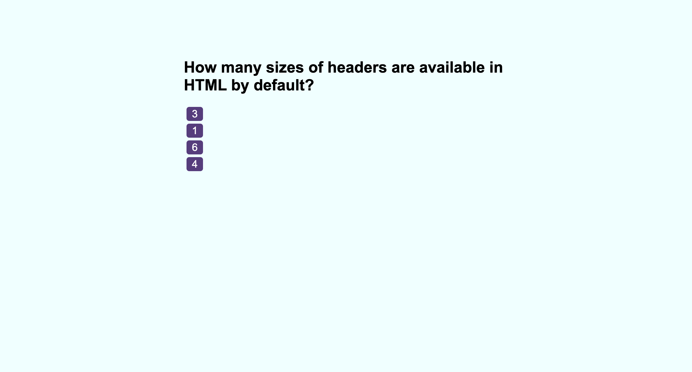

# Code Quiz

##  Description

An application which dynamically generates HTML elements to make a coding quiz. User's can input answers in a multiple-choice format to test their knowledge on Web Development
Features

##  Usage

Load the application - take the test and try answer as many questions correctly as possible. After finishing enter a name to store your score to local storage.

## Screenshot

## Link 
https://princeultim8.github.io/Code-Quiz/

